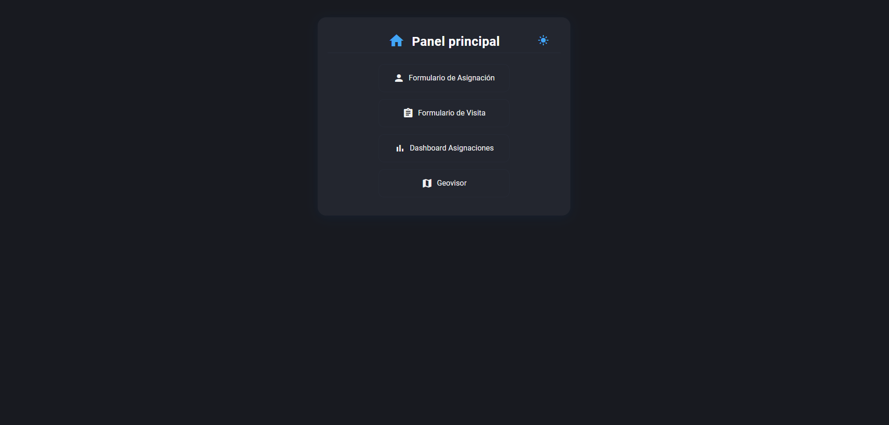
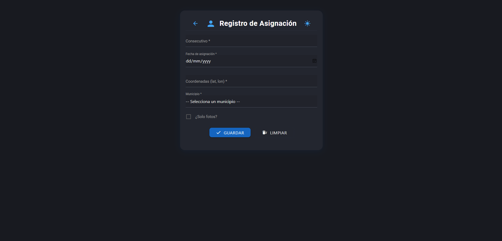
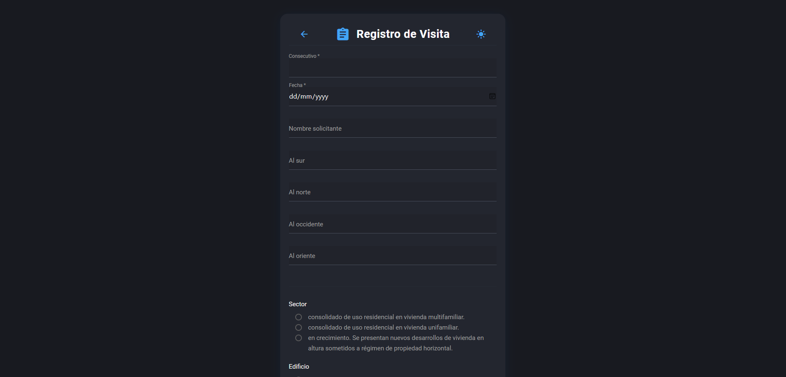

# 📊 Sistema de Gestión de Asignaciones y Geovisor Inmobiliario

Aplicación web desarrollada con **FastAPI**, **PostgreSQL/PostGIS**, **Leaflet**, **DataTables** y **Materialize CSS**, diseñada para la gestión integral de **asignaciones, visitas técnicas y avalúos urbanos/rurales**.  

Incluye formularios dinámicos, un dashboard interactivo y un geovisor inmobiliario con capas temáticas.

---

## ✨ Funcionalidades principales

### 📝 Formularios
- **Formulario de Asignación**: registro de nuevas asignaciones con consecutivo, fecha, municipio y coordenadas.  
- **Formulario de Visita**: captura de información técnica en campo, incluyendo sector, topografía, tipología, vistas y más.  
- Validación de datos en servidor y cliente.  
- Confirmaciones visuales de éxito y eliminación automática de mensajes.

### 📊 Dashboard de Asignaciones
- Tabla interactiva con **filtros por columna**, búsqueda global animada y ordenamiento avanzado.  
- **Edición en línea** de campos clave: fecha/hora de visita, fecha de entrega y observaciones.  
- Estados resaltados por colores (entregado, por visitar, con novedad, etc.).  
- Botón de geolocalización que abre directamente en Google Maps.  
- Modo oscuro persistente con almacenamiento en `localStorage`.

### 🗺️ Geovisor Inmobiliario
- Mapa interactivo con **Leaflet** y **MarkerCluster**.  
- Consulta de capas dinámicas desde la base de datos PostgreSQL/PostGIS:
  - Movimientos de masa  
  - Áreas de actividad  
  - Avalúos  
  - Barrios y localidades  
  - Estratificación socioeconómica  
  - Ofertas inmobiliarias  
  - Sitios de interés  
  - Tratamientos urbanísticos  
  - Asignaciones pendientes  
- Búsqueda por coordenadas con marcador animado.  

---

## ⚙️ Tecnologías utilizadas

- **Backend**: [FastAPI](https://fastapi.tiangolo.com/), [Pydantic](https://docs.pydantic.dev/), [psycopg2](https://www.psycopg.org/).  
- **Base de datos**: PostgreSQL + PostGIS.  
- **Frontend**: [Materialize CSS](https://materializecss.com/), [jQuery DataTables](https://datatables.net/), [Leaflet](https://leafletjs.com/).  
- **Infraestructura**: HTML5, CSS3, JavaScript (ES6).  

---

## 📂 Estructura del proyecto

```
.
├── main.py                 # Backend FastAPI (rutas, lógica, conexión DB)
├── static/
│   ├── main.js             # Lógica JS (modo oscuro, DataTables, edición en línea)
│   └── style_material.css  # Estilos personalizados (light/dark, dashboard, formularios)
├── templates/
│   ├── home.html           # Panel principal
│   ├── form_asignacion.html# Formulario de asignación
│   ├── form.html           # Formulario de visita
│   ├── dashboard.html      # Dashboard de asignaciones
│   └── mapa.html           # Geovisor Leaflet
```

---


## 📸 Capturas de pantalla



  
  
  

---

## 📌 Próximas mejoras
- Autenticación y gestión de usuarios.  
- Exportación de reportes PDF/Excel.  
- Indicadores gráficos en el dashboard.  
- Integración de IA para validación de datos.  
